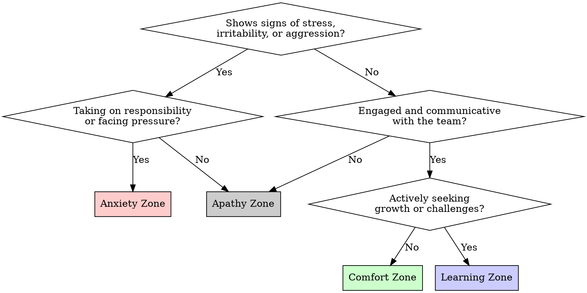

# 1on1 Prep

## Overview

Structured 1on1 preparation using the **Psychological Safety x Responsibility** 4-zone framework. Diagnoses a team member's current zone and provides zone-specific conversation strategies.

Core principle: 1on1 is a diagnostic tool — assess the zone first, then adapt your approach accordingly.

## When to Use

- Before a scheduled 1on1 meeting
- When noticing behavioral changes in a team member
- When unsure how to approach a difficult conversation with a report

**Scope:** One member at a time. This skill is for preparing a single 1on1, not for team-wide assessment.

## The 4-Zone Framework

```
                    Responsibility (High)
                         |
          Anxiety Zone   |   Learning Zone
          (Low S x Hi R) |   (Hi S x Hi R)
                         |
  ───────────────────────┼───────────────────────
                         |
          Apathy Zone    |   Comfort Zone
          (Low S x Lo R) |   (Hi S x Lo R)
                         |
                    Responsibility (Low)

  Safety (Low) ←─────────────────────→ Safety (High)
```

| Zone         | Safety | Responsibility | Signals                                                    |
| ------------ | ------ | -------------- | ---------------------------------------------------------- |
| **Learning** | High   | High           | Challenging work, growth mindset, constructive discussions |
| **Anxiety**  | Low    | High           | Aggressive tone, defensive, overworking, irritable         |
| **Comfort**  | High   | Low            | Pleasant but stagnant, no growth, low initiative           |
| **Apathy**   | Low    | Low            | Disengaged, predictable routine, potential flight risk     |

### The Uncertainty Lens

These zones also map to a single axis of **uncertainty (amount of unknowns)**:

- Too little uncertainty → boring → Apathy
- Appropriate uncertainty → growth → Learning
- Too much uncertainty → overwhelmed → Anxiety

**Key lever:** Adjust the granularity and scope of challenges assigned to the member.

## Process

### Step 1: Gather Observations

Ask the manager about recent observations. Use these diagnostic questions:

1. "How has their communication style changed recently?" (tone in reviews, meetings, Slack)
2. "What's their current workload like? Any deadline pressure?"
3. "Are they taking on new challenges or staying in familiar territory?"
4. "How do they respond to feedback or ambiguity?"
5. "Have they expressed frustration, boredom, or disengagement?"

**Supplement with objective data when available:**

| Source          | What to look for                                              |
| --------------- | ------------------------------------------------------------- |
| PR/code reviews | Tone shifts, response time, review depth                      |
| Slack/chat      | Participation frequency, emoji-only replies, thread avoidance |
| Git activity    | Commit frequency changes, scope of changes                    |
| Calendar        | Meeting load, focus time availability                         |
| Sprint metrics  | Velocity trends, story point consistency                      |

These data points reduce bias from recency effects or subjective impressions. Use them to confirm or challenge the manager's narrative, not to replace it.

### Step 2: Zone Assessment

Map observations to a zone using this decision flow.

**Handling mixed signals:** Members often straddle two zones. When observations point to multiple zones, use the **dominant signal** rule:

- Identify which axis (Safety or Responsibility) has clearer evidence
- Prioritize the zone with higher risk (Anxiety > Apathy > Comfort > Learning)
- Example: A member who is both defensive (Anxiety signal) and stagnant (Comfort signal) — if they're under deadline pressure, treat as Anxiety first. Address safety before introducing challenge.

When genuinely ambiguous, start the 1on1 with open-ended questions from both candidate zones and let the conversation reveal the true state.



### Step 3: Zone-Specific Strategy

#### Anxiety Zone → Goal: Restore Safety

| Action               | Detail                                            |
| -------------------- | ------------------------------------------------- |
| Reduce load          | Manager takes on part of the responsibility       |
| Adjust assignments   | Break large tasks into smaller, manageable pieces |
| Listen first         | Prioritize active listening over problem-solving  |
| Acknowledge pressure | Validate their effort before discussing behavior  |

**1on1 approach:** Start with empathy and acknowledgment. Do NOT lead with behavioral feedback. Address workload before addressing tone.

**Key questions:**

- "How are you feeling about the current deadlines, honestly?"
- "If you could hand off one thing right now, what would it be?"
- "What would help you feel more supported?"

#### Comfort Zone → Goal: Introduce Healthy Challenge

| Action             | Detail                                                     |
| ------------------ | ---------------------------------------------------------- |
| Clarify vision     | Help them articulate where they want to be in 1-2 years    |
| Create urgency     | Share context about team/org direction that demands growth |
| Small wins         | Assign stretch tasks with high chance of success           |
| Commit to learning | Get explicit agreement on a growth area                    |

**1on1 approach:** Appreciate their stability, then explore what excites them. Introduce gentle tension between current state and potential.

**Key questions:**

- "What part of your work feels too easy or routine?"
- "Where do you see yourself in a year? What skills would you need?"
- "Is there a project or technology you've been curious about?"

#### Apathy Zone → Goal: Rebuild Connection

| Action           | Detail                                        |
| ---------------- | --------------------------------------------- |
| Increase contact | More frequent, shorter check-ins              |
| Rebuild trust    | Show genuine interest in them as a person     |
| Find spark       | Discover what originally motivated them       |
| Remove barriers  | Identify and address sources of disengagement |

**1on1 approach:** Do not jump to solutions. Focus on rebuilding the relationship first. Increase 1on1 frequency temporarily.

**Key questions:**

- "What's been on your mind lately, work or otherwise?"
- "What originally drew you to this role/team?"
- "Is there anything about the current setup that frustrates you?"

#### Learning Zone → Goal: Sustain and Stretch

| Action              | Detail                                        |
| ------------------- | --------------------------------------------- |
| Maintain conditions | Protect the environment enabling their growth |
| Next challenge      | Collaboratively identify the next growth edge |
| Leverage strengths  | Channel their momentum to help others         |
| Career path         | Discuss longer-term aspirations               |

**1on1 approach:** Celebrate progress. Co-create the next challenge. Explore mentorship or leadership opportunities.

**Key questions:**

- "What have you learned recently that you're proud of?"
- "What's the next thing you want to tackle?"
- "Would you be interested in mentoring someone on the team?"

### Step 4: Generate Agenda

Output a structured 1on1 agenda including:

1. **Opening** — Zone-appropriate opening question
2. **Core discussion** — 2-3 targeted questions from the zone strategy
3. **Action items** — Concrete next steps for both manager and member
4. **Follow-up** — When to check in next (shorter interval for Anxiety/Apathy)

**Example output (Anxiety Zone):**

```markdown
## 1on1 Agenda: Mizuno — 2025-01-15

**Assessed zone:** Anxiety (Low Safety x High Responsibility)
**Basis:** Increased overtime, shorter PR review comments, snapped at teammate in standup

### Opening (5 min)

- "How are you feeling about things right now — not just work, but overall?"

### Core Discussion (15 min)

- "The release deadline is clearly weighing on you. What part feels most uncertain?"
- "If we could take one thing off your plate this week, what would make the biggest difference?"
- "What would 'good enough' look like for the current milestone?"

### Action Items

- [ ] **Manager:** Take over the infrastructure migration task by Friday
- [ ] **Manager:** Block 2 hours of focus time on their calendar for Wednesday
- [ ] **Mizuno:** Identify one task to delegate or descope, share by tomorrow EOD

### Follow-up

- Short check-in on Thursday (15 min) to reassess load
- Next full 1on1 in 1 week (instead of usual 2 weeks)
```

## Zone Transitions

Track zone changes over time. The goal is always to move members toward the **Learning Zone**:

```
Apathy  →  (rebuild trust)     →  Comfort or Anxiety
Anxiety →  (reduce load)       →  Learning
Comfort →  (add challenge)     →  Learning
Learning → (sustain)           →  Learning
```

**Warning signs of regression:**

- Learning → Anxiety: Overloaded with too many challenges at once
- Learning → Comfort: Challenges dried up, maintenance mode
- Comfort → Apathy: Prolonged stagnation without intervention

## Common Mistakes

| Mistake                                          | Why it fails                                           |
| ------------------------------------------------ | ------------------------------------------------------ |
| Leading with behavioral feedback in Anxiety zone | Increases defensiveness, lowers safety further         |
| Pushing challenges in Anxiety zone               | Adding load to someone already overwhelmed             |
| Accepting "I'm fine" at face value               | Especially in Apathy zone, disengagement masks as calm |
| Trying to fix everything in one 1on1             | Zone transitions take weeks, not minutes               |
| Diagnosing without data                          | Ask before assuming — your read may be wrong           |
