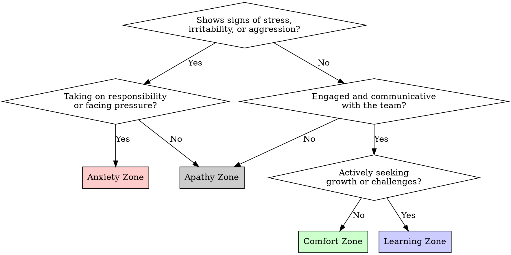

# 1on1 Prep

## Overview

Structured 1on1 preparation using the **Psychological Safety x Responsibility** 4-zone framework. Diagnoses a team member's current zone and provides zone-specific conversation strategies.

Core principle: 1on1 is a diagnostic tool — assess the zone first, then adapt your approach accordingly.

## When to Use

- Before a scheduled 1on1 meeting
- When noticing behavioral changes in a team member
- When unsure how to approach a difficult conversation with a report

**Scope:** One member at a time. This skill is for preparing a single 1on1, not for team-wide assessment.

## The 4-Zone Framework

```
                    Responsibility (High)
                         |
          Anxiety Zone   |   Learning Zone
          (Low S x Hi R) |   (Hi S x Hi R)
                         |
  ───────────────────────┼───────────────────────
                         |
          Apathy Zone    |   Comfort Zone
          (Low S x Lo R) |   (Hi S x Lo R)
                         |
                    Responsibility (Low)

  Safety (Low) ←─────────────────────→ Safety (High)
```

For detailed zone signals, strategies, transitions, and common mistakes, read [references/zone-framework.md](references/zone-framework.md).

## Process

### Step 1: Gather Observations

Ask the manager (via AskUserQuestion) about recent observations. Use these diagnostic questions:

1. "How has their communication style changed recently?" (tone in reviews, meetings, Slack)
2. "What's their current workload like? Any deadline pressure?"
3. "Are they taking on new challenges or staying in familiar territory?"
4. "How do they respond to feedback or ambiguity?"
5. "Have they expressed frustration, boredom, or disengagement?"

**Supplement with objective data when available:**

| Source          | What to look for                                              |
| --------------- | ------------------------------------------------------------- |
| PR/code reviews | Tone shifts, response time, review depth                      |
| Slack/chat      | Participation frequency, emoji-only replies, thread avoidance |
| Git activity    | Commit frequency changes, scope of changes                    |
| Calendar        | Meeting load, focus time availability                         |
| Sprint metrics  | Velocity trends, story point consistency                      |

These data points reduce bias from recency effects or subjective impressions. Use them to confirm or challenge the manager's narrative, not to replace it.

### Step 2: Zone Assessment

Map observations to a zone using this decision flow.

**Handling mixed signals:** Members often straddle two zones. When observations point to multiple zones, use the **dominant signal** rule:

- Identify which axis (Safety or Responsibility) has clearer evidence
- Prioritize the zone with higher risk (Anxiety > Apathy > Comfort > Learning)
- Example: A member who is both defensive (Anxiety signal) and stagnant (Comfort signal) — if they're under deadline pressure, treat as Anxiety first. Address safety before introducing challenge.

When genuinely ambiguous, start the 1on1 with open-ended questions from both candidate zones and let the conversation reveal the true state.


```dot
digraph zone_assessment {
    rankdir=TB;
    node [shape=diamond];

    q1 [label="Shows signs of stress,\nirritability, or aggression?"];
    q2 [label="Taking on responsibility\nor facing pressure?"];
    q3 [label="Engaged and communicative\nwith the team?"];
    q4 [label="Actively seeking\ngrowth or challenges?"];

    node [shape=box, style=filled];
    anxiety [label="Anxiety Zone", fillcolor="#ffcccc"];
    apathy [label="Apathy Zone", fillcolor="#cccccc"];
    comfort [label="Comfort Zone", fillcolor="#ccffcc"];
    learning [label="Learning Zone", fillcolor="#ccccff"];

    q1 -> q2 [label="Yes"];
    q1 -> q3 [label="No"];
    q2 -> anxiety [label="Yes"];
    q2 -> apathy [label="No"];
    q3 -> q4 [label="Yes"];
    q3 -> apathy [label="No"];
    q4 -> learning [label="Yes"];
    q4 -> comfort [label="No"];
}
```

### Step 3: Zone-Specific Strategy

Read [references/zone-framework.md](references/zone-framework.md) before generating any questions. Apply the strategy, key questions, and 1on1 approach for the assessed zone.

### Step 4: Generate Agenda

Output a structured 1on1 agenda following [references/schema.md](references/schema.md):

1. **Opening** — Zone-appropriate opening question
2. **Core discussion** — 2-3 targeted questions from the zone strategy
3. **Action items** — Concrete next steps for both manager and member
4. **Follow-up** — When to check in next (shorter interval for Anxiety/Apathy)

**Example output (Anxiety Zone):**

```markdown
## 1on1 Agenda: Mizuno — 2025-01-15

**Assessed zone:** Anxiety (Low Safety x High Responsibility)
**Basis:** Increased overtime, shorter PR review comments, snapped at teammate in standup

### Opening (5 min)

- "How are you feeling about things right now — not just work, but overall?"

### Core Discussion (15 min)

- "The release deadline is clearly weighing on you. What part feels most uncertain?"
- "If we could take one thing off your plate this week, what would make the biggest difference?"
- "What would 'good enough' look like for the current milestone?"

### Action Items

- [ ] **Manager:** Take over the infrastructure migration task by Friday
- [ ] **Manager:** Block 2 hours of focus time on their calendar for Wednesday
- [ ] **Mizuno:** Identify one task to delegate or descope, share by tomorrow EOD

### Follow-up

- Short check-in on Thursday (15 min) to reassess load
- Next full 1on1 in 1 week (instead of usual 2 weeks)
```
